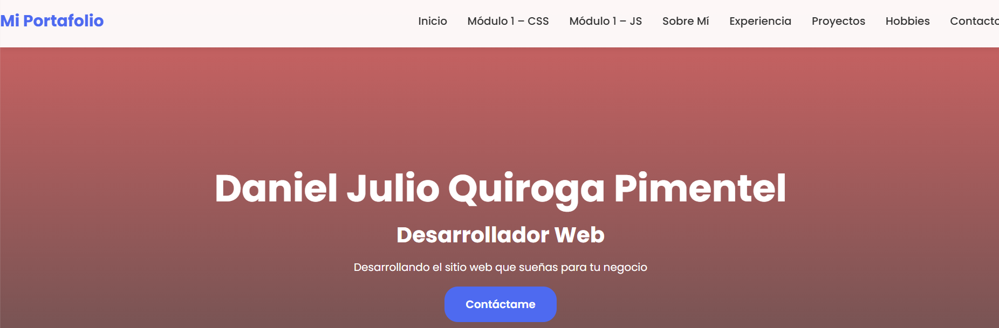
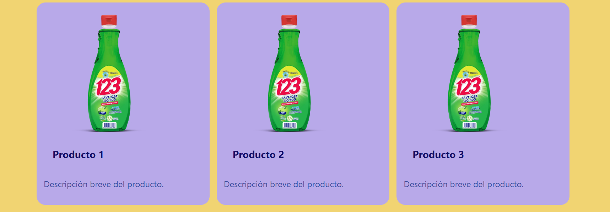
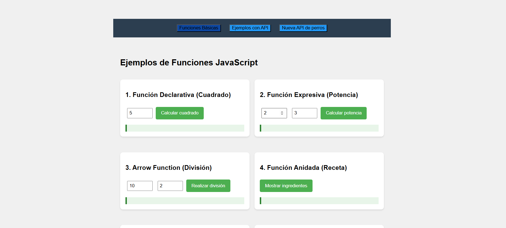
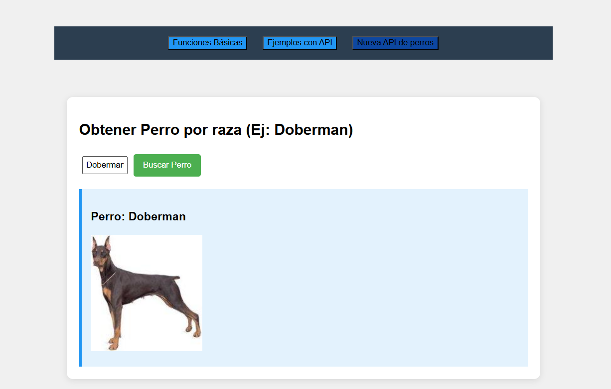

//h. Documentación en tu README: 

Proyecto final

#Descripción de la sección y uso: Módulo 1 – Ejemplos

Este proyecto es el comprendido de lo realizado en el modulo y la resolución de los incisos del proyecto final

1. clona este repositorio:

https://github.com/cronos10d/Modulo1_Ejemplos.git

2. Para entrar a las secciones

cd portafoliointegrador

Se encontrar el principal index.html donde se encuentra las secciones de:

        - css-examples
        - js-examples
        - y otras secciones importantes

3. Al realizar un: cd css-examples
   Se tiene los distintos selectores CSS que se avanzo en las clases del módulo, en temas generales:
   CSS Grid, personalización del tema, media query, flexbox, responsabilidad, etc.

   En la imágen podemos ver lo que se consigue mediante una personalización del tema y uso de paletas.

4. Al realizar un cd js-examples

   En esta sección encontrarás varios ejemplos de funciones implementadas en JavaScript. Cada ejemplo muestra un tipo de función diferente con un formulario interactivo que permite al usuario calcular o mostrar el resultado de la operación. Esta configurada responsivamente.

    Los ejemplos incluyen en tres secciones:

    

    FUNCIONES
    1. **Función Declarativa (Cuadrado)**
    2. **Función Expresiva (Potencia)**
    3. **Arrow Function (División)**
    4. **Función Anidada (Receta)**
    5. **Alcance (Scope)**
    6. **Recursividad (Factorial)**
    7. **Índice de Masa Corporal (IMC)**
    
    API POKEMON

    1. Ejemplo 1: Obtener Pokémon (Promesas)
    2. Ejemplo 2: Cadena de Evoluciones (Async/Await)
    3. Ejemplo 3: Pokémon Aleatorio (Fetch + Then)
    4. Ejemplo 4: Obtener Pokémon por Nombre (Async/Await)

    NUEVA API DE RAZA DE PERROS

    1. Obtener Perro por raza: Obtiene imágenes de perros por su raza.

    

